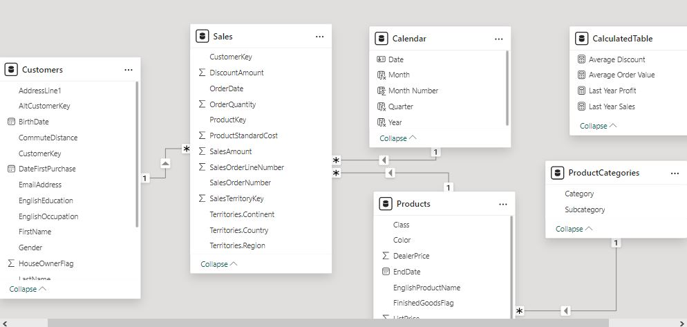

# Sales Performance and Customer Insights Analysis

## Introduction
In this project, I developed a Sales Performance and Customer Insights Dashboard to visualize key sales metrics and analyze customer behavior. Below is a breakdown of the workflow, data model, dashboard design, and insights derived from the analysis.

#### Tool Used: Power BI

## 1. Data Preparation and Modeling
#### Fact Table: Sales
This table stores key transactional data related to sales, including:

- **ProductKey:** Links sales to products.
- **OrderDate:** The date of the transaction.
- **CustomerKey:** Links sales to customers.
- **SalesTerritoryKey:** Links sales to specific regions.
- **SalesOrderNumber:** Unique identifier for each order.
- **SalesAmount, DiscountAmount, OrderQuantity, ProductStandardCost:** Key metrics for each transaction.
- **Territories.Region, Territories.Country, Territories.Continent:** Information about the geographical region for each sale.

#### Dimension Tables:
- **Products:** Contains detailed information about each product, such as the product name, category, color, size, and pricing data.
- **ProductCategories:** Categorizes products into meaningful groups (e.g., Bikes, Accessories, Clothing).
- **Customers:** Captures customer demographics, income level, purchase history, and other key attributes.

#### Lookup Table: Calendar
I created a Calendar table for time intelligence that includes:

- **Date, Month, Quarter, Year:** These columns enable detailed time-based analysis, like comparing sales by month or calculating year-over-year changes. The Calendar table is marked as a date table in Power BI to optimize time intelligence functions.

#### Data Transformation (Power Query)
- **Column Cleanup:** Removed irrelevant columns that did not add value to the analysis.
- **Missing Values:** Checked for and handled missing data to ensure the integrity of the final dashboard.

## 2. Data Model and Relationships

The data model connects the fact and dimension tables based on primary and foreign keys. This star schema design enabled efficient data retrieval and optimal performance in Power BI.

- **Sales** is connected to **Customers** via the **CustomerKey**, to **Products** via the **ProductKey**, and to **ProductCategories** through the product hierarchy.
- **Calendar** is linked to **Sales** using the **OrderDate** field, enabling time-based calculations like year-over-year sales, monthly growth, and seasonal trends.

I used DAX (Data Analysis Expressions) to create custom measures, such as:

- **Total Sales, Total Profit, and Last Year Sales:** These measures allowed me to accurately display financial performance and compare it across time periods.
- **Customer Retention:** I calculated the percentage of returning customers using DAX, enabling insights into customer loyalty.
- **Profit by Product Category:** DAX measures were used to break down profit contributions from different product categories, providing a detailed view of product performance.

## 3. Dashboard Design

I created an intuitive and interactive dashboard that allows users to explore key business metrics across multiple dimensions such as time, geography, product categories, and customer demographics.

#### Top Section: Sales KPIs
- **Total Sales:** $29.36M
- **Last Year Sales:** $13.72M
- **Total Profit:** $12.08M
- **Last Year Profit:** $5.60M
- **Total Customers:** 18K
- **Total Orders:** 60K
  
These KPIs provide an overview of the company's financial health and customer activity.

#### Middle Section: Sales and Customer Distribution
- **Sales by Country:** This bar chart shows that the United States leads in sales, followed by Australia and United Kingdom.
- **Customer Demographics:** A pie chart breaks down customers by gender (male and female).
- **Profit by Product Category:** Most profits come from Bikes, with smaller contributions from Accessories and Clothing.

#### Bottom Section: Sales Trends and Product Discounts
- **Sales Overview:** A line and bar chart showing total sales across months for a year, highlighting strong performance in June and December.
- **Discount Analysis:** A table provides a detailed view of product discounts, including product names, total quantities, and average discounts.

## 4. Key Insights and Observations

- **Sales Growth:** There is a steady increase in sales from January to December, with significant spikes in June and December, indicating seasonal trends or successful promotional activities.
- **Customer Retention:** The percentage of customers who return within 90 days remains consistently high at **99%**, and **55.8%** of customers return within three months. This demonstrates strong customer loyalty.
- **Product Performance:** Bikes are the highest-grossing category, contributing the most to overall profit, while Clothing accounts for the least. This could indicate an opportunity to improve marketing or offerings in the clothing line.
- **Geographical Distribution:** The United States dominates sales, contributing the most revenue, followed by Australia. The company might explore expanding its market presence in Europe, particularly in Germany and France, to boost sales.

## 5. Recommendations
- **Marketing Focus on High Seasons:** Focus promotional efforts in the lead-up to June and December, as these months consistently show higher sales. These campaigns could be expanded across other months to smooth out the sales trend.
- **Diversify Product Offerings:** While Bikes are the top-selling category, Clothing lags behind. Consider bundling clothing with other products or running specific promotions to increase its sales.
- **Expand Geographic Focus:** Given the dominance of sales in the United States, consider expanding successful strategies to underperforming markets, particularly in Germany and Canada.
- **Customer Retention Programs:** Given the high retention rate, investing further in loyalty programs could continue driving repeat purchases and customer engagement.

## Conclusion
This dashboard showcases my ability to analyze sales performance, build data models, and provide actionable insights using Power BI. The strong retention rates and clear sales trends are indicative of a healthy business, while the geographical distribution and product category performance suggest areas for strategic growth.
